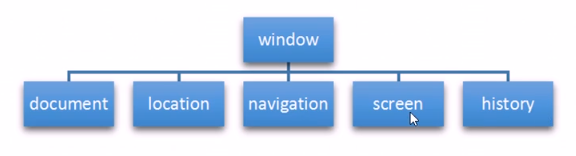

# BOM

## 1.1 BOM 概述

BOM(Browser Object Model) 即浏览器对象模型，它提供了独立于内容而与浏览器窗口进行交互的对象，其核心对象是window。

BOM 由一系列相关的对象构成，并且每个对象都提供了很多方法与属性。

BOM缺乏标准，兼容性比较差。

| DOM                                         | BOM                                |
| ------------------------------------------- | ---------------------------------- |
| 1. 文档对象模型                             | 浏览器对象模型                     |
| 2. DOM 就是把[ 文档 ]当做一个[ 对象 ]来看待 | 把[ 浏览器 ]当做一个[ 对象 ]来看待 |
| 3. DOM的顶级对象是document                  | 顶级对象是 window                  |
| 4. DOM 是W3C 标准规范                       | 浏览器厂商各自定义，兼容性较差     |

## 1.2 BOM 的构成

BOM 比 DOM更大，它包含 DOM

window对象是浏览器的顶级对象，它具有双重角色。

1. 他是JS访问浏览器窗口的一个接口
2. 它是一个全局对象。定义在全局作用域中的变量、函数都会变成window对象的属性和方法。

**window有一个特殊的属性window.name，不要再全局中使用name命名。**

## window对象的常见事件

// 待完善。。

