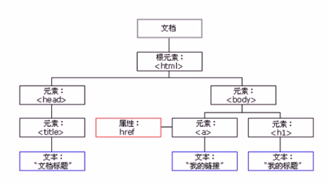
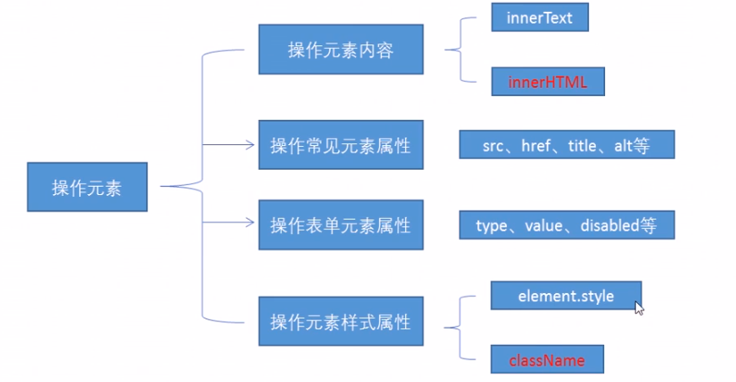
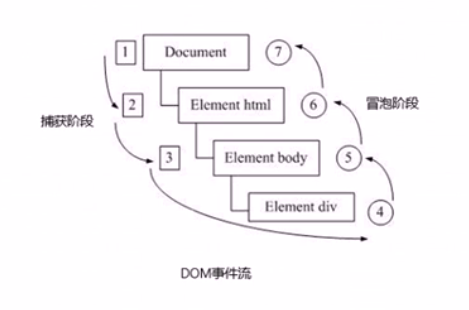
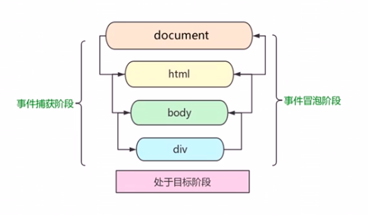

  # DOM

## 1. DOM 简介

文档对象模型（Document Oblect Model, 简称DOM），是W3C组织推荐的处理可扩展标记语言（HTML或者XML）的标准编程借口。

W3C已经定义了一系列的DOM接口，通过这些DOM接口可以改变网页的内容、结构和样式.

### 1.1 DOM 树



- 文档：一个页面就是一个文档，DOM中使用document表示
- 元素：页面中的所有标签都是元素，DOM中使用element表示
- 节点：网页中的所有内容都是节点（标签、属性、文本、注释等），DOM中使用node表示

**DOM把以上内容都看做是对象**

### 1.2 获取元素

1. 根据ID获取
2. 根据标签名获取
3. 通过HTML5新增的方法获取
4. 特殊元素获取

#### 1.2.1 根据ID获取

使用getElementById()方法可以获取带有ID的元素对象。

```js
ducoment.getElementById('id名');
```

- 因为我们文档页面从上往下加载，所以script标签写在body内容后面
- 接收参数 id 是大小敏感的字符串
- 返回一个元素对象

```html
<body>
    <div id="time">
        2019-12-13
    </div>
    <script>
    	var timer = document.getElementById("time");
        console.log(timer);
        console.dir(timer); // 该方法可以更好的查看里面的属性和方法
    </script>
</body>
```

#### 1.2.2 根据标签名获取元素

使用getElementByTagName() 方法可以返回带有标签名的对象的集合。

```js
document.getElementsByTagName('标签名');
```

- 返回的是一个对象的集合(类似于数组)，若想操作里面的元素就需要遍历
- 得到元素对象是动态的，如果在html中改变了元素内容，会反映到返回的对象上
- 若页面中没有这个元素，返回一个空的**伪数组形式**

```html
 <body>
    <ul>
      <li>me</li>
      <li>me</li>
      <li>me</li>
      <li>me</li>
      <li>me</li>
    </ul>
    <script>
    	var lis = document.getElementsByTagName('li');
		console.log(lis);
		console.log(lis[0]); // 获取单个元素
        for (var i = 0; i < lis.length; i++) {
            console.log(lis[i]);
        }
        
    </script>
  </body>
```

还可以获取某个元素(父元素)内部所有指定标签名的子元素。

```js
element.getElementsByTagName('标签名')
```

- 父元素必须是单个对象(必须指明是哪一个元素对象)。获取的不包含父元素自己。

```html
 <body>
    <ul>
      <li>me</li>
      <li>me</li>
      <li>me</li>
      <li>me</li>
      <li>me</li>
    </ul>
    <ol id="ol">
      <li>you</li>
      <li>you</li>
      <li>you</li>
      <li>you</li>
      <li>you</li>
      <li>you</li>
    </ol>
    <script>
		var ol = document.getElementsByTagName('ol');
		console.log(ol[0].getElementsByTagName('li')); // method 1
        var ol = document.getElementById('ol');
		console.log(ol.getElementsByTagName('li')); // method 2
    </script>
  </body>
```

#### 1.2.3 HTML5新增获取元素方式

```js
1. document.getElementsByClassName('类名'); // 根据类名返回对象集合
```

```js
2. document.querySelector('选择器'); // 根据指定选择器返回第一个元素对象
```

```js
3. document.querySelectorAll('选择器'); // 根据指定选择器返回
```

#### 1.2.4 获取特殊元素

- 获取 body 元素

```js
document.body
```

- 获取 html 元素

```js
document.documentElement
```

## 2. 事件

### 2.1 事件基础

JavaScript 使我们有能力创建动态页面，而事件是可以被JavaScript侦测道德行为。即触发响应的一种机制。

在网页中的每个元素都可以产生某些触发JavaScript的事件。例如，我们可以在用户点击某按钮时产生一个事件，然后去执行某些操作。

### 2.2 事件三要素

- 事件源 事件被触发的对象(谁被触发)
- 事件类型 - 如何触发 什么事件 比如鼠标点击(onclick) 还是鼠标经过 还是键盘按下
- 事件处理程序 - 通过一个函数赋值的方式完成

### 2.3 执行事件的步骤

1. 获取事件源
2. 注册事件 (绑定事件)
3. 添加事件处理程序 (采取函数赋值形式)

### 2.4 常见的鼠标事件

| 鼠标事件    | 触发条件         |
| ----------- | ---------------- |
| onclick     | 鼠标点击左键触发 |
| onmouseover | 鼠标经过触发     |
| onmouseout  | 鼠标离开触发     |
| onfocus     | 获得鼠标焦点触发 |
| onblur      | 失去鼠标焦点触发 |
| onmousemove | 鼠标移动触发     |
| onmouseup   | 鼠标弹起触发     |
| onmousedown | 鼠标按下触发     |

## 3. 操作元素

JavaScript的DOM操作可以改变网页内容、结构和样式，我们可以利用DOM操作元素来改变元素里面的内容、属性等。注意以下都是属性



### 3.1 改变元素内容

```js
element.innerText  // 不识别HTML标签，可读写，可以获取元素中的内容
```

从起始位置到终止位置的内容，但它去除 html 标签，同时空格和换行也会去掉

```js
element.innerHTML // 识别HTML标签，可读写，可以获取元素中的内容
```

起始位置到终止位置的全部内容，包括 html 标签， 同时保留空格和换行

### 3.2 常用元素的属性操作

```html
元素.属性名 = '新的属性值'
```

### 3.3 表单元素的属性操作

利用DOM可以操作如下表单元素的属性:

```
type、value、checked、selected、disabled
```

```html
<!-- Example -->
<body>
    <button>click</button>
    <input type="text" value="Please enter" />
    <script src="./script/script.js" type="text/javascript"></script>
  </body>
```

```js
var btn = document.querySelector('button');
var input = document.querySelector('input');

btn.onclick = function() {
  // input.innerHTML("点击了"); innerHTML只能修改普通盒子里面的内容，比如 div 标签里面的内容
  // 表单里面的文字内容是通过 value 修改的
  input.value = "点击了";
  this.disabled = true; // 谁调用，this指向谁
}
```

### 3.4 修改样式属性

```
1. element.style   行内样式操作
2. element.className 类名样式操作
```

- JS里面的样式采取驼峰命名法，比如fontSize、backgroundColor
- JS修改 style 样式操作，产生的是行内样式，css权重比较高
- 如果样式修改较多，可以采用操作类名的方式更改元素样式
- class 因为是个保留字，因此使用 className 来操作元素类名属性
- className 会直接更改元素的类名，会覆盖原先的类名

```html
<!-- Example element.style -->
<body>
    <div></div>
    <script src="./script/script.js" type="text/javascript"></script>
  </body>
```

```css
div {
  width: 100px;
  height: 100px;
  background-color: red;
}
```

```js
var div = document.querySelector('div');
div.onclick = function() {
  // div.style里面的属性 采取驼峰命名法
  this.style.backgroundColor = "pink";
}
```

```html
<!-- Example: element.calssName --> 
<body>
    <div></div>
    <script src="./script/script.js" type="text/javascript"></script>
  </body>
```

```css
div {
  width: 100px;
  height: 100px;
  background-color: red;
}

.change {
    width: 200px;
    height: 200px;
    background-color: pink;
}
```

```js
// 适合于样式较多或者功能复杂的情况
var div = document.querySelector('div');
div.onclick = function() {
  this.className = "change";
}
```

### 3.5 自定义的属性操作

```js
// 获取属性值
1. element.getAttribute('属性名') // 获得属性值，包括自定义的属性
2. element.属性名  // 只能获取内置的属性
```

```js
// 设置属性值
1. element.属性 = '值' // 设置内置属性
2. element.setAttribute('属性'， '值'); // 修改属性值，包括自定义的属性
```

```js
// 删除属性
element.removeAttribute('属性')
```

### 3.6 H5自定义属性

自定义属性目的：是为了保存并使用数据。有些数据可以保存到页面中而不用保存到数据库中。

自定义属性是通过getAttribute('属性')获取；

但是有些自定义属性很容易引起歧义，不容易判断是元素的内置属性还是自定义属性。所以H5给我们新增了自定义属性：

#### 3.6.1 设置自定义属性

Ｈ5规定自定义属性以 **`data-`** 开头作为属性名并赋值。

比如`<div data-index= "1"></div>`

#### 3.6.2 获取自定义属性

```js
1. element.getAttribute('属性')  // 兼容性好，推荐
2. H5新增element.dataset.index 或者 element.dataset['index']
```

- dataset 是一个集合里面放了所有的以data开头的自定义属性;
- H5新增的方法只能获取以data开头的自定义属性, ie11以上才支持，有兼容性问题；
- 如果自定义属性里面有多个 - 链接的单词，我们获取的时候采用驼峰命名法。

## 4. 节点操作

### 4.1 获取元素方法的对比

获取元素通常使用两种方式：

1. 利用 DOM 提供的方法获取元素 - 逻辑性不强、比较繁琐

- document.getElementById()
- document.getElementsByTagName()
- document.querySelector等

2. 利用节点层次关系获取元素

- 利用父子兄弟节点关系获取元素、
- 逻辑性强, 但是兼容性稍差

### 4.2 节点简介

网页中的所有内容都是节点（标签、属性、文本、注释等），在 DOM 中，节点使用 node 来表示。

HTML DOM 树中的所有节点均可以通过 JavaScript 进行访问，所有 HTML 元素（节点）均可被修改，也可以创造或删除.

一般，节点至少拥有node Type（节点类型）、nodeName（节点名称）和nodeValue（节点值）这三个基本属性。

- 元素节点 nodeType 为 1
- 属性节点 nodeType 为 2
- 文本节点 nodeType 为 3 (文本节点包含文字、空格、换行等)

### 4.3 节点层级

利用 DOM 树可以把节点划分为不同的层级关系，常见的是父子兄层级关系。

#### 4.3.1 父级节点

```js
element.parentNode;
```

- 得到的是离元素最近的父级节点；
- 如果找不到父节点就返回 null。

####　4.3.2 子节点

```js
parentNode.childNodes //标准
```

- 返回包含指定节点的所有子节点的集合，该集合为即时更新的集合；
- 包含文本节点，元素节点等等；
- 如果只想要获得里面的元素节点，则需要专门处理。所以我们一般不提倡使用childNodes。

```js
parentNode.children  // 非标准
```

- parentNode.children 是一个**只读属性**，返回所有的**子元素**节点。它只返回子元素节点,其余节点不返回 。
- 虽然children是一个非标准，但是得到了各个浏览器的支持，因此我们可以放心使用。

```js
1. parentNode.firstChild  // 第一个子节点，不管元素节点还是文本节点
2. parentNode.lastChild // 最后一个子节点，不管元素节点还是文本节点
```

- 找不到返回null；

```js
parentNode.firstElementchild
parentNode.lastElementchild
```

- 有兼容性问题，ie9以上才支持
- 返回的是元素节点，找不到返回null

#### 4.3.3 兄弟节点

```js
1. node.nextSibling
```

- 返回当前元素的下一个兄弟节点，找不到则返回null，
- **包含所有节点**， 包含元素和文本节点

```js
2. node.previousSibling;
```

- 返回当前元素的上一个兄弟节点，找不到则返回null，
- **包含所有节点**， 包含元素和文本节点

```js
3. node.nextElementSibling;
```

- 返回当前元素的下一个兄弟元素节点，找不到则返回null，
- ie9以上

```js
4. node.previousElementSibling;
```

- 返回当前元素的上一个兄弟元素节点，找不到则返回null，
- ie9以上

#### 4.3.4 创建新的节点

```js
document.createElement('tagName');
```

- 创建由 tagName 指定的 HTML 元素。

#### 4.3.5 添加节点

```js
1. node.appendChild(child)
```

- node.appendChild() 方法将一个节点添加到指定父节点的子节点列表末尾。类似于CSS里面的 after 伪元素

```js
2. node.insertBefore(child, 指定元素)
```

- 将一个节点添加到父节点的指定子节点前面。类似于 CSS 里面的 before 伪元素。

#### 4.3.6 删除节点

```js
node.removeChild(child)
```

- 从DOM中删除一个子节点，返回删除的节点

#### 4.3.7 复制节点

```js
node.cloneNode()
```

- 返回调用该方法的节点的一个副本。也称为克隆节点/拷贝节点
- 如果括号参数为空或者为false，则是**浅拷贝**，即只克隆复制节点本身，不克隆里面的子节点。
- 括号为 true 深拷贝，则会复制标签里面的内容.

### 4.4 三种动态创建元素区别

```js
1. document.write()
2. element.innerHTML
3. document.createElement()
```

1. document.write()

- document.write() 是直接将内容写入页面的内容流，**但是文档流执行，则会导致页面全部重绘，会导致页面之前的内容没了。**

2. element.innerHTML / document.createElement()

```js
element.innerHTML = '<a href="#">百度</a>'

document.createElement('a');
```

- innerHTML 是将内容写入某个 DOM 节点，不会导致页面全部重绘；
- innerHTML 创建多个元素效率更高 （不要使用拼接字符，采取数组形式拼接），结构稍微复杂
- createElement() 创建多个元素效率稍微低一点点，但是结构清晰

## 5 事件高级

### 5.1 注册事件

给元素添加事件，称为注册事件或者绑定事件。

注册事件的两种方式：传统方式和方法监听注册方式

传统注册方式

- 利用 on 开头的事件 onclick
- `<button onclick="alert('hi')" ></button>`
- btn.onclick = function() {}
- 特点： 注册事件的唯一性
- 同一个元素同一个事件只能设置一个处理函数，最后注册的处理函数将会覆盖前面的处理函数

方法监听注册事件

- w3c标准 推荐方式
- addEventListener()它是一个方法
- IE9之前的IE不支持此方法，可使用attachEvent()代替
- 特点：同一个元素同一个事件可以注册多个监听器
- 按照注册顺序依次执行

#### 5.1.2 addEventListener 事件监听方式

```js
eventTarget.addEventListener(type, listener[, useCapture])
```

- 将指定的监听器注册到eventTarget(目标对象)上，当该对象触发指定事件时，就会执行事件处理函数。
- 同一个元素，同一个事件可以添加对个侦听器（事件处理程序）
- type: 事件类型字符串，比如 click、mouseover，注意这里不要带 on
- listener： 事件处理函数，事件发生时，会调用该监听函数
- useCapture：可选参数，是一个布尔值，默认是false， 指定事件是处于捕获阶段(true)还是在冒泡阶段(false)。

```html
<!-- EXAMPLE -->
<button>方法监听事件</button>
    <script src="./script/script.js" type="text/javascript"></script>
```

```js
var btn = document.querySelectorAll('button');
btn[0].addEventListener('click', function() {
  alert(22);
})

btn[0].addEventListener('click', function() {
  alert(10);
})
```

#### 5.1.3 删除（解绑）事件

1. 传统方法 - null;
2. eventTarget.removeEventListener();

```html
 <body>
    <button>传统方法</button>
    <button>方法监听事件</button>
    <script src="./script/script.js" type="text/javascript"></script>
  </body>
```

```js
var btn = document.querySelectorAll('button');

// 1. 传统方式删除事件
btn[0].onclick = function() {
  alert(12);
  btn[0].onclick = null;
}

// eventElement
btn[1].addEventListener('click', fn);
function fn() {
  alert(55);
  btn[1].removeEventListener('click', fn); // 里面的fn, 不需要小括号
}
```

### 5.2 DOM 事件流

**事件流**描述的是从页面中接受事件的顺序。

事件发生时会在元素节点之间按照特定的顺序传播，这个**传播过程**即 **DOM 事件流**.

Example: 给一个div注册了点击事件

1. 捕获阶段
2. 当前目标阶段
3. 冒泡阶段





**注意:**

1. JS代码中只能执行捕获或者冒泡其中的一个阶段。
2. onclick 和 attachEvent 只能得到冒泡阶段。
3. 可以通过addEventListener(type, listener[, useCapture]) 第三个参数指定事件阶段。

```html
<!-- EXAMPLE -->
<body>
    <div class="father">
      <div class="son">son
      </div>
    </div>
    <script src="./script/script.js" type="text/javascript"></script>
  </body>
```

```js
// 捕获阶段
var son = document.querySelector('.son');
son.addEventListener('click', function() {
  alert('son');
}, true);

var father = document.querySelector('.father');
father.addEventListener('click', function() {
  alert('father');
}, true);

var document = document.querySelector('document');
document.addEventListener('click', function() {
  alert('document');
}, true);

// 冒泡阶段
var son = document.querySelector('.son');
son.addEventListener('click', function() {
  alert('son');
}, false);

var father = document.querySelector('.father');
father.addEventListener('click', function() {
  alert('father');
}, false);

var document = document.querySelector('document');
document.addEventListener('click', function() {
  alert('document');
}, false);
```

```css
* {
  padding: 0;
  margin: 0;
}

.father {
  width: 100px;
  height: 100px;
  display: table-cell;
  text-align: center;
  vertical-align: middle;
  background-color: red;
}

.son {
  width: 50px;
  height: 50px;
  background-color: aqua;
  display: inline-block;
}
```

### 5.3 事件对象

```js
eventTarget.onclick = function(event) {}
eventTarget.addEventListener('click', function(event) {})
// 这个event就是事件对象
```

官方解释: event对象代表事件的状态，比如键盘按键的状态、鼠标的位置、鼠标按钮的状态。

简单解释: 事件发生后，跟事件相关的一系列信息数据的集合都放到这个对象里面，这个对象就是事件对象event，它有很多属性和方法。比如，谁绑定了事件；如果鼠标触发了事件的话，会得到鼠标的相关位置信息，如鼠标位置。

```html
<body>
    <div>123</div>
    <script src="./script/script.js" type="text/javascript"></script>
  </body>
```

```js
var div = document.querySelector('div');
div.onclick = function(event) {
  console.log(event);
}
// 1. event 就是一个事件对象 写到我们侦听函数的小括号里面 当形参来看
// 2. 事件对象只有有了事件才会存在，他是系统给我们创建的，不需要我们传递参数
// 3. 事件对象是我们事件的一系列相关数据的集合 跟事件相关的 
//    比如鼠标点击里面就包含了鼠标的相关信息，鼠标坐标啊，
//    如果是键盘事件里面就包含键盘事件的信息，判断用户按下了那个键
// 4. 事件对象有ie兼容性问题, ie678使用window.event
```

### 5.4 事件对象的常见属性和方法

| 事件对象属性方法    | 说明                                                |
| ------------------- | --------------------------------------------------- |
| e.target            | 返回触发事件的对象   标准                           |
| e.srcElement        | 返回触发事件的对象  非标准 ie6-8使用                |
| e.type              | 返回事件的类型 比如   click mouseover 不带on        |
| e.cancelBubble      | 该属性阻止冒泡    非标准 ie6-8                      |
| e.returnValue       | 该属性 阻止默认事件（默认行为）  非标准 ie6-8使用   |
| e.preventDefault()  | 该方法阻止默认事件（默认行为）标准 比如不让链接跳转 |
| e.stopPropagation() | 阻止冒泡 标准                                       |

### 5.5 事件委托

事件委托也称为事件代理，在jQuery里面称为事件委派

事件委托的原理：

**不是每个子节点单独设置事件监听器，而是事件监听器设置在其父节点上，然后利用冒泡原理影响设置每个节点。**

案例：给ul注册点击事件，然后利用事件对象的target来找到当前点击的li，因为点击li，事件会冒泡到ul上，ul有注册时间，就会触发事件监听器。

### 5.6 常用的鼠标事件

1. 禁止鼠标右键菜单

contextmenu主要控制应该何时显示上下文菜单，用取消默认的上下文菜单

```js
document.addEventListener('contextmenu', function(e) {
e.preventDefault();
}) 
```

2. 禁止鼠标选中(selectstart 开始选中)

```js
document.addEventListener('selectstart', function() {
e.preventSefault();
})
```

3. 鼠标移动事件 - 一定要记得单位

```js
document.addEventListener('mousemove', function() {

})
```

### 5.7 鼠标事件对象

| 鼠标事件对象          | 说明                                 |
| --------------------- | ------------------------------------ |
| e.clientX / e.clientY | 返回鼠标相对于浏览器窗口可视区的坐标 |
| e.pageX / e.pageY     | 返回鼠标相对于文档页面的坐标         |
| e.screenX / e.screenY | 返回鼠标相对于电脑屏幕的坐标         |

### 5.8 键盘事件

| 键盘事件   | 触发条件                                                     |
| ---------- | ------------------------------------------------------------ |
| onkeyup    | 某个键盘按键被松开时触发, 不区分大小写（keyCode）            |
| onkeydown  | 某个按键被按下时触发，不区分大小写（keyCode）                |
| onkeypress | 某个键盘按键被按下时触发，不能识别功能键 比如 ctrl shift，区分大小写（keyCode） |

### 5.8.1 键盘事件对象

```js
document.addEventListener('keydown', function(e) {
  console.dir(e);
  console.log(e.keyCode);  // 获取按键的ASCII码，判断按得那个键
})document.addEventListener('keydown', function(e) {
  console.dir(e);
})
```

