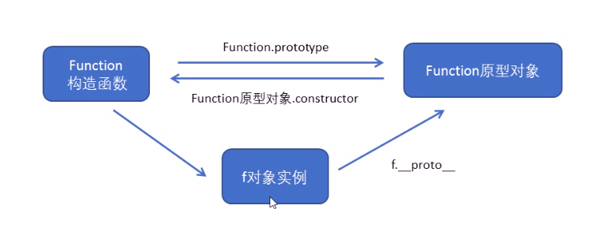

# 函数

## 1. 函数的定义方式

- 函数声明（function)
- 函数表达式
- Function

所有的函数都是Function的实例对象。



## 2.函数的调用方式

```js
// 1. 普通函数
function fn() {
    console.log("me");
}
// fn(); 或者 fn.call()

// 2.对象的方法
var obj = {
    sayHi: function() {
        console.log("me");
    }
}
// obj.sayHi();

// 3. 构造函数
function Star() {
    
};
// new Star();

// 4. 绑定事件函数
btn.onclick = function() {}; // 点击了这个按钮就可以调用这个函数

// 5. 定时器函数
// setInterval(function() {}, 1000); 这个函数是定时器自动1秒钟调用一次

// 6. 立即执行函数
(function() {
    console.log("me");
})();
// 立即执行函数是自动调用

```

## 3. 函数中 this 的指向

this 的指向，是在调用函数的时候确定的。调用的方式不同决定了this 的指向不同，一般指向调用者。

| 调用方式     | this指向                                  |
| ------------ | ----------------------------------------- |
| 普通函数     | window                                    |
| 构造函数     | 实例对象 原型对象里面的方法也指向实例对象 |
| 对象方法     | 该方法所属对象                            |
| 事件绑定方法 | 绑定事件对象                              |
| 定时器函数   | window                                    |
| 立即执行函数 | window                                    |

### 3.1 改变函数内部this指向

- bind()
- call()
- apply()

#### 3.1.1 call()方法

```js
func.call(thisArg, Arg1, Arg2,...)
```

#### 3.1.2 apply()

可以调用一个函数，也可以改变函数的this指向;

它的参数必须是数组（伪数组）

```js
var obj = {
	name: 'andy';
};

function fn() {
    console.log(this);
};

fn.apply(obj， ['pink']);
```

apply的应用，比如可以利用apply借助于数学内置对象求最大值

```js
var arr = [1, 66, 3, 99, 4];
Math.max.apply(Math, arr);
```

#### 3.1.3 bind()方法

不会调用函数。但能改变函数内部this指向

```js
fun.bind(thisArg, arg1, arg2, ...)
```

- thisArg: 在fun函数运行时指定的this值
- arg1, arg2： 传递的其他参数
- 返回由指定的this值和初始化参数改造的原函数拷贝

```js
var obj = {
	name: 'andy';
};

function fn() {
    console.log(this);
};

fn.bind(obj); // 是一个新函数
var f = fn.bind(obj);
f();
```

bind函数的应用： 

有的函数我们不需要立即调用，但是又想改变这个函数内部的this指向时用bind.

### 3.2 call apply bind总结

#### 3.2.1 相同点：

都可以改变函数内部的this 指向。

#### 3.2.2 区别点：

1. call 和 apply 会调用函数，并且改变函数内部this指向。
2. call 和 apply 传递的参数不一样，call 传递参数arg1, arg2 ... 形式 apply 必须数组形式
3. bind 不会调用函数，可以改变函数内部this指向。

#### 3.2.3 主要应用场景

1. call 经常做继承；
2. apply 经常和数组结合使用。
3. bind 不调用函数，但是想改变this指向。

## 4. 高阶函数

函数的参数接受的是一个函数或者函数返回一个函数。

##  5. 闭包

### 5.1 变量作用域

变量根据作用域的不同分为两种：局部变量和全局变量。

1. 函数内部可以使用全局变量。
2. 函数外部不可以使用函数内定义的局部变量。
3. 当函数执行结束后，函数中定义的局部变量就会被销毁。

### 5.2 什么是闭包

**闭包**(closure)指有权访问另一个函数作用域中变量的**函数**。简单理解就是，一个作用域可以访问另外一个函数内部的局部变量。

```js
function fn() {
	var num = 10;
	function fun() {
	console.log(num);
	}
    fun();
}
fn();
```


