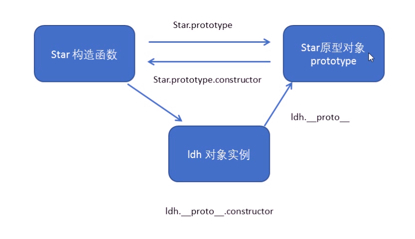
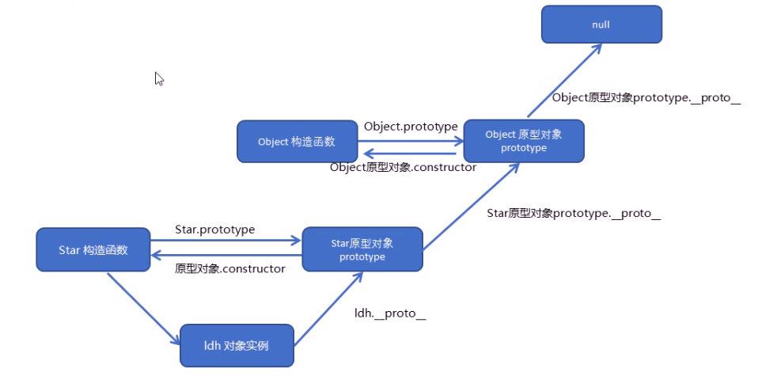
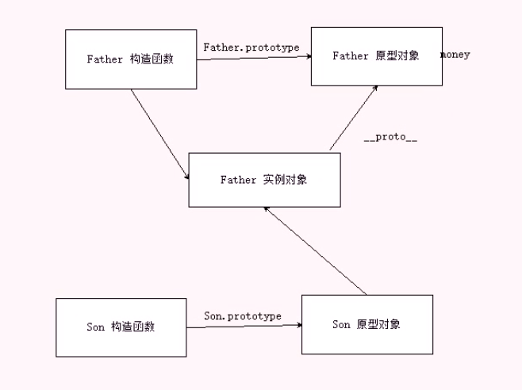

## String

### 方法

1. 从字符串中获取单个字符

   ```js
   // method 1
   `cat`.charAt(1); // return "a"
   ```

   ```js
   // method 2
   `cat`[1]; // return "a"
   ```

   

2. 字符串的比较

使用比较操作符（`>` / `<` / `>= `/ `<=`）

3. 基本字符串与字符串对象

- 基本字符串：字符串字面量 (通过单引号或双引号定义) 和 直接调用 String 方法(没有通过 new 生成字符串对象实例)的字符串都是基本字符串。
- 字符串对象：new 生成字符串对象。

4. str.substr(start, length)

> - 不指定length，会返回start及后面的所有字符
>
> - length是0或者负值，返回空字符串

- 不指定length

```js
var str = 'It is a great day.'
console.log(str.substr(5));
// return " a great day."
```

- 指定length

```js
var str = 'It is a great day.'
console.log(str.substr(5,6)); // return " a gre"
```

- length为负数

```js
var str = 'It is a great day.'
console.log(str.substr(5,-7)); // return ""
```

5. str.trim()

> Arguments
>
> > 不接受任何参数
>
> Return:
>
> > 返回一个开头和末尾没有空格的新字符串。

example 1: 

```js
var str = "javascript         "
var st = str.trim();
console.log(str) // return "javascript"
```

example 2:

```js
var str = "           javascript"
var st = str.trim();
console.log(str) // return "javascript"
```

6. str.toLowerCase()

>Arguments:
>
>> 不接受参数
>
>Return:
>
>> 返回一个新字符串，其中的大写字母变成小写。

Example 1.

```js
var str = 'It iS a Great Day.';
var string = str.toLowerCase();
console.log(string) // return "it is a great day." 
```

7. str.toUpperCase()

> Arguments:
>
> > 不接受参数
>
> Return:
>
> > 返回一个新字符串，其中的小写字母变成大写。

Example 1.

```js
var str = 'It iS a Great Day.';
var string = str.toUpperCase(); // IT IS A GREAT DAY.
```

8. str.indexOf(searchValue, index)

>Arguments:
>
>> searchValue: 要被搜索的字符串
>>
>> index:  搜索起始索引
>
>Return:
>
>> 若找到则返回首次找到searchValue的索引；未找到返回-1

Example 1.

```js
var str = 'Departed Train';
return str.indexOf('Train'); // 9
```

Example 2.

```js
var str = 'Departed Train';
return str.indexOf('train'); // -1
```

Example 3.

```js
var str = 'Departed Train before another Train';
return str.indexOf('Train'); // 9
```

9. str.lastIndexOf(searchValue, index)

> Arguments:
>
> > searchValue: 带查找的字符串；
> >
> > index: 从后往前查找的起始索引
>
> Returns:
>
> > 若找到，返回最后一次找到searchValue的index；未找到，则返回-1

Example 1

```js
var str = 'Departed Train';
var index = str.lastIndexOf('Train'); // 9
```

Example 2

```js
var str = 'Departed Train';
return str.lastIndexOf('Train'); // 9
```

Example 3

```js
var str = 'Departed Train before another Train';
return str.lastIndexOf('Train') // 6
```

10. str.includes(searchvalue, start)

>Arguments:
>
>> searchvalue: 查找的子串
>>
>> start: 查找的起始位置
>
>Returns：
>
>> 若包含searchvalue返回true，否则fasle

Example 1

```js
var str = "Welcome to GeeksforGeeks".
return str.includes("Geeks")  // true
```

11. str.split(separator, limit)

> Arguments:
>
> > separator: a string, 指定分割点, 若不指定(或者指定的字符不存在)分割为单个字符数组
> >
> > limit: 分割的次数上限，未分割的部分将舍弃
>
> Returns:
>
> > a array of strings, 分割后的各自子串的数组

Example 1

```js
var str = 'It iS a 5r&e@@t Day.';
var array = str.split(" "); // [It,iS,a,5r&e@@t,Day.]
```

Example 2

```js
var str = 'It iS a 5r&e@@t Day.';
var array = str.split(" ",2); // [It,iS]
```

12. str.substring(Startindex, Endindex)

>The **string.substring()** is an inbuilt function in JavaScript which is used to return the part of the given string from start index to end index. Indexing start from zero (0).
>
>Arguments:
>
>Startindex: 起始位置
>
>Endindex: 终止位置
>
>Returns: 
>
>a new string which is part of the given string.

13. str.slice(startindex, endindex)

>The **string.slice()** is an inbuilt function in javascript which is used to return a part or slice of the given input string.

```js
// Taking a string as input. 
   var A = 'Ram is going to school'; 
     
   // Calling of slice() function. 
   b = A.slice(0, 5);  // Ram i
  
   // Here starting index is 1 given 
   // and ending index is not given to it so 
   // it takes to the end of the string   
   c = A.slice(1);  // am is going to school
     
   // Here endingindex is -1 i.e, second last character 
   // of the given string. 
   d = A.slice(3, -1);  // is going to schoo
   e = A.slice(6); // going to school
```

14. str.replace(A, B)

**Describe:**

> The **string.replace()** is an inbuilt function in JavaScript which is used to replace a part of the given string with some another string or a regular expression. *The original string will remain unchanged.*

**Parameters:** Here the parameter A is regular expression and B is a string which will replace the content of the given string.

**Return Values:** It returns a new string with replaced items.

```js
// Assigning a string 
var string = 'GeeksForGeeks is a CS portal'; 
  
// Calling replace() function 
var newstring = string.replace(/GeeksForGeeks/, 'gfg');  // gfg is a CS portal
```

15. str.match(searchvalue / regexp) 

>**Describe:**
>
>> match() 方法将检索字符串 stringObject，以找到一个或多个与 regexp 匹配的文本。这个方法的行为在很大程度上有赖于 regexp 是否具有标志 g。
>>
>> 如果 regexp 没有标志 g，那么 match() 方法就只能在 stringObject 中执行一次匹配。如果没有找到任何匹配的文本， match() 将返回 null。否则，它将返回一个数组，其中存放了与它找到的匹配文本有关的信息。该数组的第 0 个元素存放的是匹配文本，而其余的元素存放的是与正则表达式的子表达式匹配的文本。除了这些常规的数组元素之外，返回的数组还含有两个对象属性。index 属性声明的是匹配文本的起始字符在 stringObject 中的位置，input 属性声明的是对 stringObject 的引用。
>>
>> 如果 regexp 具有标志 g，则 match() 方法将执行全局检索，找到 stringObject 中的所有匹配子字符串。若没有找到任何匹配的子串，则返回 null。如果找到了一个或多个匹配子串，则返回一个数组。不过全局匹配返回的数组的内容与前者大不相同，它的数组元素中存放的是 stringObject 中所有的匹配子串，而且也没有 index 属性或 input 属性。
>>
>> **注意：**在全局检索模式下，match() 即不提供与子表达式匹配的文本的信息，也不声明每个匹配子串的位置。如果您需要这些全局检索的信息，可以使用 RegExp.exec()。
>
>**Arguments:**
>
>> | 参数        | 描述                                                         |
>> | :---------- | :----------------------------------------------------------- |
>> | searchvalue | 必需。规定要检索的字符串值。                                 |
>> | regexp      | 必需。规定要匹配的模式的 RegExp 对象。如果该参数不是 RegExp 对象，则需要首先把它传递给 RegExp 构造函数，将其转换为 RegExp 对象。 |
>
>**Returns:**
>
>>存放匹配结果的数组。该数组的内容依赖于 regexp 是否具有全局标志 g。

**例子 1**

在本例中，我们将在 "Hello world!" 中进行不同的检索：

```js
<script type="text/javascript">

var str="Hello world!"
document.write(str.match("world") + "<br />")
document.write(str.match("World") + "<br />")
document.write(str.match("worlld") + "<br />")
document.write(str.match("world!"))

</script>
```

输出：

```
world
null
null
world!
```

**例子 2**

在本例中，我们将使用全局匹配的正则表达式来检索字符串中的所有数字：

```js
<script type="text/javascript">

var str="1 plus 2 equal 3"
document.write(str.match(/\d+/g))

</script>
```

输出：

```
1,2,3
```

## 异常捕获

### 1. 异常

当JavasScript引擎执行JavasScript代码时，发生了错误，导致程序停止运行

### 2. 异常抛出

当异常抛出，并且将这个异常生成一个错误信息

### 3. 异常不活：

```js
try {
    发生异常的代码块；
} catch(err) {
    错误信息处理；
}
```

## 对象

###　1. 创建对象的方式

#### 1.1 利用对象字面量创建对象 {}

>```js
>Example:
>var obj = {
>  name: "Bob",
>  age: 18,
>  sex: "男",
>  sayHi: function() {
>      console.log("hi~");
>  }
>}
>```
>
>- 对象里面的属性或方法采用键值对的形式书写；
>- 多个属性或者方法中间用逗号隔开；
>- 方法冒号后面跟的是一个匿名函数。

#### 1.2 利用new Object 创建对象

> ```js
> Example:
> var obj = new Object();
> obj.name = "Bob";
> obj.age = 18;
> obj.sex = "男";
> obj.sayHi = function() {
>     console.log("hi~");
> }
> ```
>
> - 利用等号赋值，添加对象的属性和方法；
> - 每个属性和方法之间用分号分开。

#### 1.3 利用构造函数

##### 1.3.1 why?

> 前面两种创建方式一次只能创建一个对象，若多个对象的属性和方法是相同的，多次创建比较麻烦，可以将这些相同的属性和方法封装到一个函数中，即构造函数。

#### 1.3.2 创建对象

> ```js
> function 构造函数名() {
>   this.属性 = 值;
>   this.方法 function() {}
> }
> new 构造函数名();
> 
> // Example:
> function Star(name, age, sex) {
>     this.name = name;
>     this.age = age;
>     this.sex = sex;
> }
> var obj1 = new Star("Bob", 18, "男");
> var obj2 = new Star("Tom", 17, "男");
> ```
>
> - 利用构造函数创建对象的过程又称为对象实例化;
> - 实例成员是构造函数内部通过this添加的成员name age sing;
> - 实例成员只能通过实例化的对象来访问，不可以通过实例函数访问；
> - 静态成员，在构造函数本身上添加的成员，例如`Star.skill = sing;`，不能通过对象访问。

### ２.　使用对像的方式

- 对象名.属性名

> `obj.name;`

- 对象名['属性名']

> `obg['age'];`

- 对象名.方法名()

> `obj.sayHi();`

### 3. new关键字执行过程

> - new 构造函数在内存中创建了一个空的对象；
> - this指针会指向刚才创建的对象；
> - 执行构造函数中的代码，给这个空对象添加属性和方法；
> - 返回对象。

### ４. 遍历对象的属性(for in)

> ```js
> // Example:
> for (var k in obj) {
>     console.log(k); // 属性名
>     console.log(obj[k]); // 属性值
> }
> ```

###  5. 构造函数和原型

#### 5.1 构造函数原型prototype

构造函数中通过原型分配的函数是所有对象所共享的。

JavaScript规定，每一个构造函数都有一个prototype属性，指向另一个对象。*注意这个prototype就是一个对象，这个对象的所有属性和方法，都会被构造函数所拥有。*

**我们可以把那些不变的方法，直接定义在prototype对象上，这样所有对象的实例就可以共享这些方法。**

```js
function Star(uname, age) {
    this.uname = uname;
    this.age = age;
}
Star.prototype.sing = function() {
   console.log('我会唱歌');
}
```

**一般情况下，我们的公共属性定义到构造函数里面，公共的方法我们放到原型对象身上。**

#### 5.2 对象原型\__proto\_\_

**对象都会有一个属性\_proto\_**指向构造函数的prototype原型对象，之所以我们对象可以使用构造函数prototype原型对象的属性和方法，就是因为对象有\_proto_原型的存在。

- \_\_proto\_\_对象原型和原型对象prototype是等价的

#### 5.3 方法的查找规则

首先看实例对象身上是否有`sing`方法， 如果有就执行这个对象上的singf方法，如果没有这个方法，因为有\_\_proto\_\_的存在，就去构造函数原型对象prototype身上去查找sing这个方法。

#### 5.4 constructor 构造函数

对象原型(\_\_proto\_\_)和构造函数(prototype)原型对象里面都有一个constructor属性，constructor我们称为构造函数，因为它指回构造函数本身。

constructor主要用于记录该对象引用于那个构造函数，它可以让原型对象重新指向原来的构造函数。

```js
function Star(uname, age) {
    this.uname = uname;
    this.age = age;
}
Star.prototype = {       // 覆盖了prototype里面的所有对象，包括consructor,需要手动指回原来的构造函数
    constructor: Star;
    sing: function() {
        console.log("sing");
    }
    movie: function() {
        console.log("movie");
    }
}
```

#### 5.5 构造函数、实例、原型对象三者之间的关系



#### 5.6 原型链



只要是对象就有\_\_proto\_\_原型，指向原型对象

我们Star原型对象里面的\_\_proto\_\_原型指向的是Object.prototype

#### 5.7 对象成员查找机制

> 1. 当访问一个对象的属性（包括方法时），首先查找这个对象自身有没有该属性。
> 2. 如果没有就查找它的原型（也就是\_\_proto\_\_指向的prototype原型对象）。
> 3. 如果还没有找到就查找原型对象的原型（Object的原型对象）。
> 4. 以此类推一直找到Object为止（null）。
> 5. \_\_proto\_\_对象原型的意义就在于为对象成员查找机制提供一个方向，或者说一条线路。

#### 5.8 this 指向

- 在构造函数里面的this指向的是实例对象，谁调用构造函数就指向谁。

- 原型对象函数里面的this指向的是实例对象
- 方法里面的this指向调用的对象实例

#### 5.9 扩展内置对象

可以通过原型对象，对原来的内置对象进行扩展自定义的方法。比如给数组增加自定义求偶和的功能。

```js
// 给数组添加求和方法
Array.prototype.sum = function() {
    var sum = 0;
    for (var i = 0; i < this.length; i++) {
        sum += this[i];
    }
    return sum;
}
```

**注意：数组和字符串内置对象不能对原型对象执行覆盖操作Array.prototype = {},，只能是Array.prototype.xxx = function(){}的方式。**

### 6. 继承

ES6之前并没有给我们提供extends继承。我们可以通过构造函数＋原型对象模拟实现继承，被称为组合继承。

#### 6.1 call()

调用这个函数，并且修改函数运行时的this指向

```js
fun.call(thisArg, arg1, ar2, 、、、)
```

> Arguments:
>
> thisArg: 当前调用函数this的指向函数
>
> arg1, arg2: 传递的其他参数

```js
// 调用函数
function fn() {
    console.log("me");
}
fn.call(); // me
```

```js
// 改变函数的this指向
function fn(x, y) {
    console.log("me");
    console.log(this);  此时指向windows
    console.log(x + y);
}
var o = {
    name: "andy"
};　
fn.call(o, x, y); // this 指向ｏ
```

#### 6.2 借用构造函数继承父类型属性

**原理:**通过call()把父类型的this指向子类型的this，这样就可以实现子类型继承父类型的属性。

```js
// 借用父构造函数继承属性
// 1. 父构造函数
function Father(uname, age) {
    // this 指向父构造函数的对象实例
    this.uname = uname;
    this.age = age;
}

// 子构造函数
function Son(uname, age) {
    // this 指向子构造函数的对象实例
    Father.call(this, uname, age); // 更改指向，指向子构造函数
}
var son = new Son('Bob', 18);
console.log(son);
```

#### 6.3 借用原型对象继承方法

```js
// Error method
// 父构造函数
function Father(uname, age) {
    // this 指向父构造函数的对象实例
    this.uname = uname;
    this.age = age;
}

Father.prototype.money = function() {
    console.log(10000);
}

// 子构造函数
function Son(uname, age) {
    // this 指向子构造函数的对象实例
    Father.call(this, uname, age); // 更改指向，指向子构造函数
}
Son.prototype = Father.prototype; // 子构造函数的原型对象被覆盖,修改了子原型对象，父也会更改
var son = new Son('Bob', 18);
console.log(son);
```

使用父构造函数的实例对象，继承父构造函数的方法



```js
// right method
// 父构造函数
function Father(uname, age) {
    // this 指向父构造函数的对象实例
    this.uname = uname;
    this.age = age;
}

Father.prototype.money = function() {
    console.log(10000);
}

// 子构造函数
function Son(uname, age) {
    // this 指向子构造函数的对象实例
    Father.call(this, uname, age); // 更改指向，指向子构造函数
}

Son.prototype = new Father(); // 子构造函数的原型对象指向父构造函数的实例对象，
Son.prototype.constructor = Son; // 别忘了利用constructor指回原来的构造函数
Son.prototype.exam = function() {
    console.log(100);
}
var son = new Son('Bob', 18);
console.log(son);

```

**如果利用对象的形式修改了原型对象，别忘了利用constructor指回原来的构造函数**

### 7. ES6类

ES6通过使用类实现面向对象编程

> 1. 类有原型对象prototype;
> 2. 类原型对象prototype里面有constructor指向类本身；
> 3. 类可以通过原型对象添加方法。
> 4. 类创建的实例对象有\_\_proto\_\_原型指向类的原型对像。

```js
class Star {

}
console.log(typeof (Star)); // function
console.log(Star.prototype);
console.log(Star.prototype.constructor);
Star.prototype.sing = function () {
    console.log('sing');
}
```

